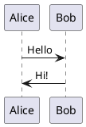

1. **You**: How can i create a PlanetUML diagram from .puml file using Python?
2. **ChatGPT**: Creating a PlantUML diagram from a `.puml` file using Python can be done in a few simple steps. You’ll need to use a library that can interface with PlantUML. One popular option is the `plantuml` module.

### Step-by-Step Guide

#### Step 1: Install Required Packages

You need to install the `plantuml` Python package. You can do this using pip. Open your terminal or command prompt and run:

```bash
pip install plantuml
```

#### Step 2: Write Your PlantUML Code

Create a `.puml` file with your PlantUML code. Here’s a simple example of what the contents of `diagram.puml` might look like:



Save this as `diagram.puml`.

#### Step 3: Create a Python Script to Generate the Diagram

Now, you can write a Python script that reads this `.puml` file and generates the diagram. Here’s a basic example:

```python
from plantuml import PlantUML

# Set the URL of the PlantUML server (or you can use a local server)
plantuml_url = "http://www.plantuml.com/plantuml/png/"
pu = PlantUML(url=plantuml_url)

# Path to your .puml file
puml_file = 'diagram.puml'

# Read the content of the .puml file
with open(puml_file, 'r') as file:
    puml_code = file.read()

# Generate the diagram and save it as a PNG file
output_file = 'diagram.png'
pu.processes(puml_code, output_file)

print(f'Diagram generated and saved as {output_file}')
```

#### Step 4: Run Your Python Script

Make sure your `.puml` file is in the same directory as your Python script (or adjust the path accordingly). Then, run your script:

```bash
python your_script.py
```

Replace `your_script.py` with the name of your Python file.

#### Step 5: Check the Output

Once the script has run successfully, you should see a file named `diagram.png` in your directory, which is the generated PlantUML diagram.

### Key Points

1. **Install the plantuml library**: Make sure you have it installed to interface with the PlantUML server.
2. **Write your PlantUML code**: This is done in a `.puml` file.
3. **Read the file and process it with Python**: Use the `plantuml` library to send your code to the PlantUML server and retrieve the generated image.
4. **Output the result**: The diagram is saved as a PNG file in your working directory.

### Optional: Setting Up a Local PlantUML Server

If you don't want to rely on the online PlantUML server, you can set up a local server using Docker. The command to run it would be:

```bash
docker run --rm -p 8080:8080 --name plantuml plantuml/plantuml
```

Then you can set `plantuml_url` in the Python script to `http://localhost:8080/plantuml/png/`.

Feel free to ask if you have more questions!
3. **You**: Code gave me this error message: "AttributeError: 'PlantUMLHTTPError' object has no attribute 'message'"
What do i do?
4. **ChatGPT**: The error message you're encountering, **"AttributeError: 'PlantUMLHTTPError' object has no attribute 'message'"**, indicates that your code is trying to access an attribute named `message` on a `PlantUMLHTTPError` object, but this attribute doesn't exist. 

Here’s a step-by-step approach to troubleshoot and resolve this issue:

### 1. **Identify the Source of the Error**
   - Check the line of code where the error occurs. This will help you understand which part of your code is attempting to access the `message` attribute.

### 2. **Understand the Error Class**
   - `PlantUMLHTTPError` is likely a custom exception related to the PlantUML library you're using. Look at the documentation or source code for this class to see its defined attributes.
   - Instead of `message`, it might have attributes like `args`, `status_code`, or `error`.

### 3. **Modify Your Code**
   - Replace the reference to `message` with the correct attribute. For example, if the exception has a `args` attribute, you can access the error message like this:

   ```python
   try:
       # Your code that might raise PlantUMLHTTPError
   except PlantUMLHTTPError as e:
       print(e.args)  # This usually contains the error message
   ```
   
   - If another attribute contains the information you need (e.g., `status_code`), adjust your handling accordingly.

### 4. **Check the Documentation**
   - If you're using a library, check its documentation for error handling. It might provide specific guidance on how to handle exceptions like `PlantUMLHTTPError`.

### 5. **Review Related Examples**
   - Look for examples in the library’s repository or documentation. This can guide you on how to handle exceptions correctly.

### 6. **Testing**
   - After making changes, run your code again to see if the error has been resolved.

### Example Code
Here’s an example of how you might handle an exception properly:

```python
from plantuml import PlantUMLHTTPError

try:
    # Code that may cause the error
    pass
except PlantUMLHTTPError as e:
    # Check the attributes available for the error
    print("Error:", e.args)  # Print the error message
    # Other attributes can be inspected here as well
```

### Conclusion
- Always check for the attributes available in exceptions you encounter.
- Adjust your code to handle exceptions based on their actual structure rather than assuming they have specific attributes.

If you provide more context or code snippets, I can help you further!
5. **You**: How can I create a plantuml diagram without reaching website, using only .jar file on Python?
6. **ChatGPT**: Creating a PlantUML diagram using only a `.jar` file from Python can be accomplished by using the `subprocess` module to call the PlantUML jar file directly. Here’s a step-by-step guide on how to do that:

### Step 1: Install Java

Make sure you have Java installed on your system because PlantUML runs on the Java Runtime Environment (JRE).

- You can check if Java is installed by running:

  ```bash
  java -version
  ```

- If it's not installed, download and install it from the [official Java website](https://www.oracle.com/java/technologies/javase-jdk11-downloads.html).

### Step 2: Download PlantUML

1. Download the PlantUML jar file from the [PlantUML website](http://plantuml.com/download).
2. Save it to a directory that is easy to access. For example, let's say you save it in `C:\plantuml\plantuml.jar` or `/path/to/plantuml/plantuml.jar` on Linux.

### Step 3: Install Python

Ensure you have Python installed on your system. You can check if Python is installed by running:

```bash
python --version
```

### Step 4: Create a UML Diagram with Python

You can use Python to create a UML diagram by writing the PlantUML code to a `.puml` file and then executing the PlantUML jar file to generate the diagram.

Here’s a sample Python script to do this:

```python
import subprocess
import os

def create_plantuml_diagram(plantuml_code, output_filename):
    # Step 1: Write the PlantUML code to a .puml file
    with open('diagram.puml', 'w') as f:
        f.write(plantuml_code)

    # Step 2: Prepare the command to run PlantUML
    plantuml_jar_path = '/path/to/plantuml/plantuml.jar'  # update this path
    command = ['java', '-jar', plantuml_jar_path, 'diagram.puml']

    # Step 3: Execute the command
    try:
        subprocess.run(command, check=True)
        print(f"Diagram generated as {output_filename}.")
    except subprocess.CalledProcessError as e:
        print(f"An error occurred: {e}")

# Example PlantUML code
plantuml_code = """
@startuml
Alice -> Bob: Hello
Bob -> Alice: Hi
@enduml
"""

# Desired output filename without .png (PlantUML will add it)
output_filename = "diagram"
create_plantuml_diagram(plantuml_code, output_filename)
```

### Step 5: Run Your Script

- Save the script as `create_plantuml.py`.
- Navigate to the directory where your script is saved.
- Run the script:

```bash
python create_plantuml.py
```

### Step 6: Check the Output

After you run the script, check the same directory for a file named `diagram.png`, which will be your generated UML diagram.

### Key Points to Remember

- **Java Installation**: PlantUML requires Java, so ensure it's properly installed.
- **File Path**: Update the path to the PlantUML jar file in the script.
- **PlantUML Syntax**: Make sure your PlantUML code is correct; otherwise, the generated diagram may be empty or incorrect.

This approach allows you to generate UML diagrams locally without relying on any web-based services.
7. **You**: How can I make a git commit dependencies graph in Python?
8. **ChatGPT**: Creating a Git commit dependencies graph in Python can be a fun project. This involves extracting commit history from a Git repository and then visualizing the dependencies between commits, especially focusing on merges and branching. Below is a step-by-step guide to help you achieve this.

### Step 1: Setup the Environment

1. **Install Required Packages**:
   You'll need `GitPython` to interact with Git repositories and `networkx` for graph handling. If you want to visualize the graph, you can also use `matplotlib`.

   You can install these libraries using pip:

   ```bash
   pip install GitPython networkx matplotlib
   ```

### Step 2: Clone the Git Repository (if not already)

You can either clone a repository or use an existing one. Here is how to clone:

```bash
git clone https://github.com/yourusername/yourrepository.git
```

### Step 3: Extract Commit Data

You can use `GitPython` to access the commits in your repository. Here’s a simple script to gather commit data:

```python
import git

def get_commit_data(repo_path):
    repo = git.Repo(repo_path)
    commits = repo.iter_commits()
    
    commit_data = {}
    for commit in commits:
        commit_data[commit.hexsha] = {
            'message': commit.message.strip(),
            'parents': [parent.hexsha for parent in commit.parents]
        }
    return commit_data

repo_path = 'path/to/your/repo'
commit_data = get_commit_data(repo_path)
```

### Step 4: Create the Dependency Graph

Now that you've gathered commit data, you can use `networkx` to create a directed graph where each commit points to its parent commits:

```python
import networkx as nx
import matplotlib.pyplot as plt

def create_commit_graph(commit_data):
    graph = nx.DiGraph()
    
    for commit, data in commit_data.items():
        graph.add_node(commit, message=data['message'])
        for parent in data['parents']:
            graph.add_edge(commit, parent)
    
    return graph

commit_graph = create_commit_graph(commit_data)
```

### Step 5: Visualize the Graph

You can visualize the graph using `matplotlib`:

```python
def visualize_graph(graph):
    pos = nx.spring_layout(graph)  # positions for all nodes
    labels = {node: graph.nodes[node]['message'][:10] for node in graph.nodes()}  # Shorten labels for clarity
    
    plt.figure(figsize=(12, 8))
    nx.draw(graph, pos, with_labels=True, labels=labels, node_size=3000, node_color='lightblue', font_size=10)
    plt.title("Git Commit Dependencies Graph")
    plt.show()

visualize_graph(commit_graph)
```

### Summary

1. **Install Necessary Libraries**: Use `pip` to install `GitPython`, `networkx`, and `matplotlib`.
2. **Extract Commit Data**: Write a function to traverse the commit history and store commit messages and parent relationships.
3. **Create Graph**: Utilize `networkx` to create a directed graph from the commit relationships.
4. **Visualize Graph**: Use `matplotlib` to render and visualize the graph.

Feel free to adapt and modify this code to better suit your needs, such as filtering commits, customizing the graph layout, or improving visualization aesthetics!
9. **You**: How can I make a git commit dependency graph in Python using plantuml?
10. **ChatGPT**: Creating a Git commit dependency graph in Python using PlantUML is a great way to visualize your repository’s history. Here’s how you can do it step by step:

### Step 1: Install Required Tools

Before you begin, ensure you have the following installed:

1. **Git**: To interact with your repository.
2. **Python**: To run your script.
3. **PlantUML**: You can download `plantuml.jar` from the [official website](http://plantuml.com/download).
4. **Graphviz**: This is used to generate visualizations. You can install it following the instructions for your OS (e.g., `brew install graphviz` on macOS, `sudo apt install graphviz` on Ubuntu).

### Step 2: Set Up Your Python Environment

Create a new Python file (e.g., `git_graph.py`) and ensure you have the necessary libraries. For this task, you will need `subprocess` to run Git commands.

### Step 3: Write the Python Script

The script will:

1. Retrieve the commit history from your Git repository.
2. Format the commit data for PlantUML.
3. Generate a PlantUML diagram from the formatted data.

Here’s a basic template for your script:

```python
import subprocess

def get_git_commits():
    # Run git log command to get commit history
    result = subprocess.run(
        ["git", "log", "--pretty=format:%H %P"],
        capture_output=True,
        text=True,
        check=True
    )
    return result.stdout.splitlines()

def create_plantuml_graph(commits):
    lines = ["@startuml", "!define RECTANGLE class"]
    for commit in commits:
        parts = commit.split()
        commit_hash = parts[0]
        parents = parts[1:]  # list of parent commits

        # Add commit as a rectangle
        lines.append(f"RECTANGLE {commit_hash} as {commit_hash}")
        
        # Create dependencies (links to parent commits)
        for parent in parents:
            lines.append(f"{parent} --> {commit_hash}")

    lines.append("@enduml")
    return "\n".join(lines)

def save_plantuml_file(content, filename="git_graph.puml"):
    with open(filename, 'w') as file:
        file.write(content)

def main():
    commits = get_git_commits()
    plantuml_content = create_plantuml_graph(commits)
    save_plantuml_file(plantuml_content)
    print("PlantUML file generated: git_graph.puml")

if __name__ == "__main__":
    main()
```

### Step 4: Run the Script

1. Navigate to your Git repository in the terminal.
2. Run the script using Python.
   ```bash
   python git_graph.py
   ```
3. This will generate a file named `git_graph.puml` in your current directory.

### Step 5: Generate the Diagram

Now, you need to generate the diagram from the PlantUML file. You can run the following command in the terminal:

```bash
java -jar plantuml.jar git_graph.puml
```

This will create a PNG (or another format based on your PlantUML settings) of the commit graph.

### Key Points

- **Git Command**: `git log --pretty=format:%H %P` outputs each commit's hash and its parent hashes.
- **PlantUML**: The `RECTANGLE` is used to represent each commit visually, and arrows indicate dependencies.
- **Graph Generation**: You need Java to run the PlantUML jar file.

Feel free to modify the script to customize the output further or to handle specific cases (e.g., merges). This is just a basic introduction to get you started!